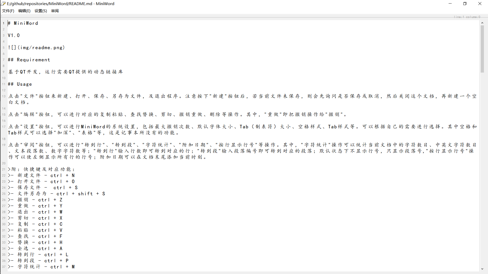

# MiniWord

V1.0

## Requirement

基于QT开发，运行需要QT提供的动态链接库

## Usage

点击"文件"按钮来新建、打开、保存、另存为文件，及退出程序。注意按下"新建"按钮后，若当前文件未保存，则会先询问是否保存或取消，然后关闭这个文档，再新建一个空白文档。

点击"编辑"按钮，可以进行对应的复制粘贴、查找替换、剪切、撤销重做、删除等操作。其中，"重做"即把撤销操作给"撤销"。

点击"设置"按钮，可以进行MiniWord的系统设置，包括最大撤销次数、默认字体大小、Tab（制表符）大小、空格样式、Tab样式等。可以根据自己的需要进行选择。其中空格和Tab样式可以选择"加深"、"表格"等，这是记事本所没有的功能。

点击"审阅"按钮，可以进行"转到行"、"转到段"、"字符统计"、"附加日期"、"按行显示行号"等操作。其中，"字符统计"操作可以统计当前文档中的字符数目、中英文字符数目、文本段落数、数字字符数等；"转到行"输入行数即可转到对应的行；"转到段"输入段落编号即可转到对应的段落；默认状态下不显示行号，只显示段落号,"按行显示行号"操作可以使左侧显示所有行的行号；附加日期可以在文档末尾添加当前时刻。

>附：快捷键及对应功能：
>- 新建文件 - ctrl + N
>- 打开文件 - ctrl + O
>- 保存文件 -  ctrl + S
>- 文件另存为 - ctrl + shift + S
>- 撤销 - ctrl + Z
>- 重做 - ctrl + Y
>- 退出 - ctrl + W
>- 剪切 - ctrl + X
>- 复制 - ctrl + C
>- 粘贴 - ctrl + V
>- 查找 - ctrl + F
>- 替换 - ctrl + H
>- 全选 - ctrl + A
>- 转到行 - ctrl + L
>- 转到段 - ctrl + P
>- 字符统计 - ctrl + M
>- 打开帮助文档 - ctrl + H